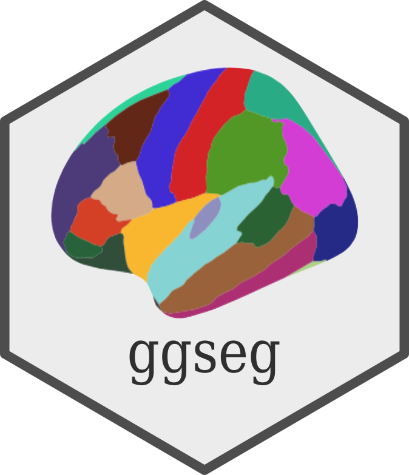

```{r}
#| label: setup
#| include: false
knitr::opts_chunk$set(
  collapse = TRUE,
  comment = "#>",
  out.width = "100%",
  fig.path = "man/figures/README-",
  fig.retina = 3,
  echo = TRUE
)
```

# ggseg 
<!-- badges: start -->
[](https://CRAN.R-project.org/package=ggseg)
[](https://github.com/ggsegverse/ggseg/actions/workflows/R-CMD-check.yaml)
[](https://github.com/ggsegverse/ggseg/actions/workflows/code-quality.yaml)
[](https://github.com/ggsegverse/ggseg/actions/workflows/test-coverage.yaml)
[](https://r-pkg.org/pkg/ggseg)
[](https://lifecycle.r-lib.org/articles/stages.html)
[](https://github.com/ggsegverse/ggseg/actions?query=workflow%3Apkgcheck)
<!-- badges: end -->

Neuroimaging analyses produce region-level results -- cortical thickness,
p-values, network assignments -- that need to end up on a brain figure.
ggseg stores brain atlas geometries as simple features and plots them as
ggplot2 layers, so you get publication-ready brain figures with the same
code you'd use for any other ggplot.

Mowinckel & Vidal-Piñeiro (2020). [*Visualization of Brain Statistics
With R Packages ggseg and ggseg3d.*](https://doi.org/10.1177/2515245920928009)
Advances in Methods and Practices in Psychological Science.

## Installation

Install from CRAN:

```{r}
#| label: install
#| eval: false
install.packages("ggseg")
```

Or get the development version from the [ggsegverse r-universe](https://ggsegverse.r-universe.dev):

```r
options(repos = c(
  ggsegverse = "https://ggsegverse.r-universe.dev",
  CRAN = "https://cloud.r-project.org"
))
install.packages("ggseg")
```

## Quick start

```{r}
#| label: load
#| message: false
library(ggseg)
library(ggplot2)
```

### Built-in atlases

ggseg ships with three atlases: `dk` (Desikan-Killiany cortical
parcellation), `aseg` (automatic subcortical segmentation), and `tracula`
(white matter tracts). `plot()` gives you a quick overview:

```{r}
#| label: fig-atlases
#| fig-cap: "Overview of the dk and aseg built-in brain atlases."
#| out-width: "100%"
plot(dk())
plot(aseg())
```

### Plotting your own data

Pass a data frame to `ggplot()` with a column that matches the atlas
(typically `region` or `label`). `geom_brain()` handles the join:

```{r}
#| label: fig-external-data
#| fig-cap: "Brain plot coloured by external data, faceted by group."
#| message: false
library(dplyr)

some_data <- tibble(
  region = rep(
    c(
      "transversetemporal",
      "insula",
      "precentral",
      "superiorparietal"
    ),
    2
  ),
  p = sample(seq(0, .5, .001), 8),
  groups = c(rep("g1", 4), rep("g2", 4))
)

ggplot(some_data) +
  geom_brain(
    atlas = dk(),
    position = position_brain(hemi ~ view),
    aes(fill = p)
  ) +
  facet_wrap(~groups) +
  scale_fill_viridis_c(option = "cividis", direction = -1) +
  theme_void()
```

## More atlases

Many additional atlases are available through the
[ggsegverse r-universe](https://ggsegverse.r-universe.dev):

```{r}
#| label: install-extra
#| eval: false
install.packages("ggsegYeo2011", repos = "https://ggsegverse.r-universe.dev")
```

## Learn more

The [package website](https://ggsegverse.github.io/ggseg/) has vignettes
covering external data, view positioning, the `geom_sf()` workflow, and
reading FreeSurfer stats files.

## Funding

This tool is partly funded by:

**EU Horizon 2020 Grant:** Healthy minds 0-100 years: Optimising the use
of European brain imaging cohorts (Lifebrain). Grant agreement number:
732592.
