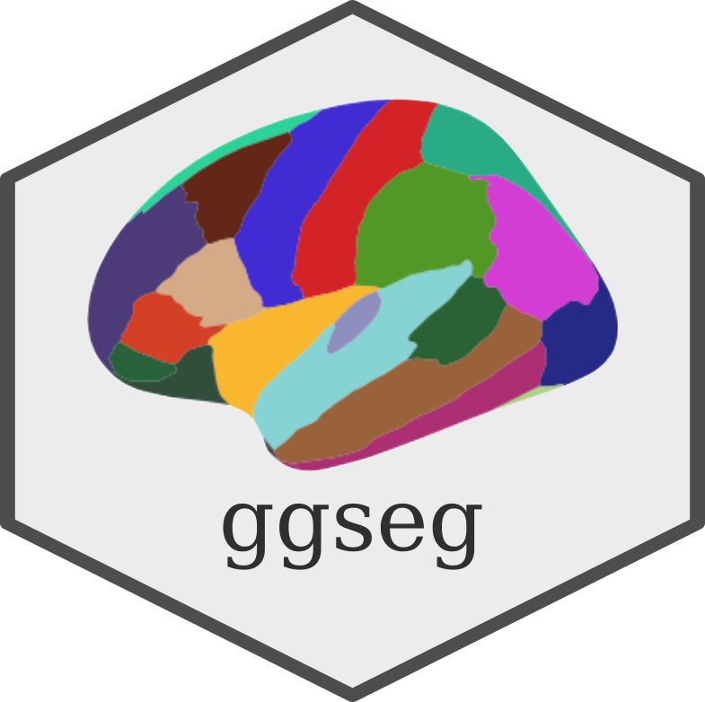
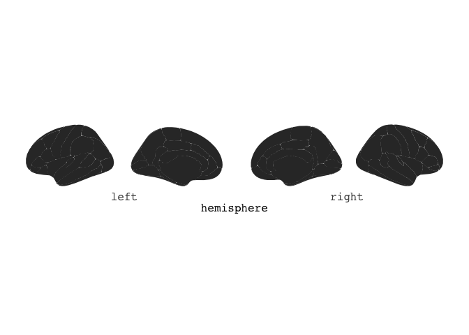
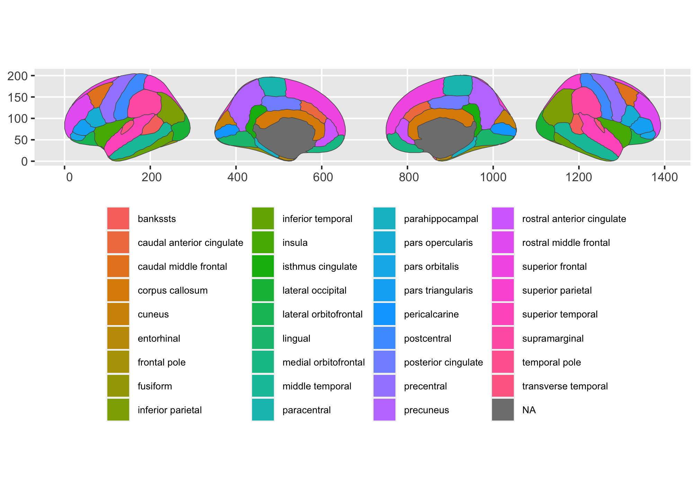

# ggseg 

<!-- badges: start -->

[](https://github.com/LCBC-UiO/ggseg/actions)
[](https://CRAN.R-project.org/package=ggseg)
[](https://codecov.io/gh/LCBC-UiO/ggseg)
[](https://www.tidyverse.org/lifecycle/#maturing)
<!-- badges: end -->

This package mainly contains a plotting function `ggseg` and data.frames
of different brain atlases for plotting. Plotting results of analyses on
regions or networks often involves swapping between statistical tools,
like R, and software for brain imaging to correctly visualise analysis
results.

This package aims to make it possible to plot results directly through
R.

## Atlases

There are currently four atlases available in the package:

1.  `dk` - Desikan-Killany atlas (aparc).  
2.  `aseg` - Automatic subcortical segmentation.

We are working on creating a detailed description in the wiki on how to
create and contribute atlases to the package. The `ggseg` function
already allows you to provide it with a data.frame of a custom atlas if
you have it, but is must correspond to certain specifications to work.

**Note:** As of version 1.5.3, `ggseg` was split into two packages: one
for 2d polygon plots in ggplot, and another for 3d mesh plots through
plotly. This was done to reduce package size, dependencies, and also to
simplify maintenance. If you want the 3d plotting tool, please go the
[ggseg3d repository](https://github.com/LCBC-UiO/ggseg3d).

You may find more atlases and functions to create new atlases in the
companion package [ggsegExtra](https://github.com/LCBC-UiO/ggsegExtra).

## Installation

The package can be installed using devtools. The package includes some
large datasets for the brain coordinates. Please be patient during
download and install, it will take some time.

``` r
install.packages("remotes")
remotes::install_github("LCBC-UiO/ggseg", build_vignettes = TRUE)
```

The functions are now installed, and you may load them when you want to
use them. All functions are documented in standard R fashion.

## Use

``` r
library(ggseg)
library(ggplot2)
plot(dk)
```



``` r
plot(aseg)
```



The package also has several vignettes, to help you get started using
it. You can access it [here](https://lcbc-uio.github.io/ggseg/)

You can also see one of the creators blog for introductions to its use
[here](https://drmowinckels.io/blog/introducing-the-ggseg-r-package-for-brain-segmentations/)

### Report bugs or requests

Don’t hesitate to ask for support using [github
issues](https://github.com/LCBC-UiO/ggseg/issues), or requesting new
atlases. While we would love getting help in creating new atlases, you
may also request atlases through the issues, and we will try to get to
it.

# Funding

This tool is partly funded by:

**EU Horizon 2020 Grant:** Healthy minds 0-100 years: Optimising the use
of European brain imaging cohorts (Lifebrain).

**Grant agreement number:** 732592.

**Call:** Societal challenges: Health, demographic change and well-being
