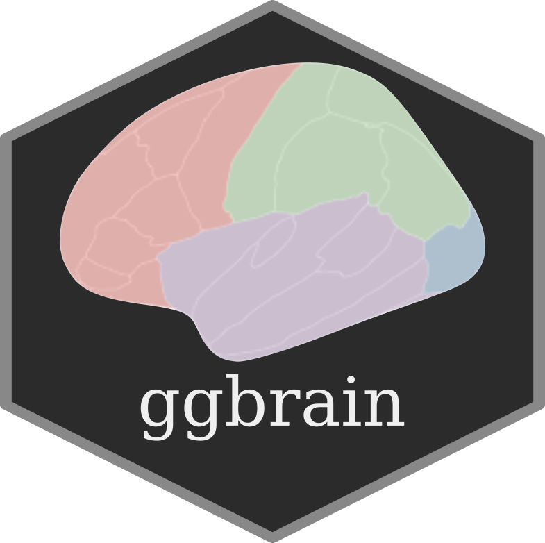

Plotting tool for brain atlases
================
Athanasia Mowinckel & Didac Vidal Pineiro



This package mainly contains a plotting function `ggbrain` and data.frames of different brain atlases for plotting. Plotting results of analyses on regions or networks often involves swapping between statistical tools, like R and Matlab, and software for brain imaging to correctly visualise analysis results.

This package aims to make it possible to plot results directly through R.

Atlases
-------

There are currently three atlases available in the package:
1. `dkt` - Desikan-Killany atlas.
2. `yeo7` - Yeo 2011 7 resting-state networks.
3. `yeo17` - Yeo 2011 17 resting-state network.
4. `aseg` - Automatic subcortical segmentation.
5. `midsagittal` - mid-sagittal slice showing the cerebellum, 3<sup>rd</sup> and 4<sup>th</sup> ventricles, corpus callosum etc.

We are working on creating a detailed description in the wiki on how to create and contribute atlases to the package. The `ggbrain` function already allows you to provide it with a data.frame of a custom atlas if you have it, but is must correspond to certain specifications to work.

Please see the wiki for information (still being updated), or inspect the included datasets for requirements.

Installation
------------

The package can be installed using devtools:

``` r
install.packages("devtools")
devtools::install_github("LCBC-UiO/ggbrain", build_vignettes = TRUE)
```

The functions are now installed, and you may load them when you want to use them. All functions are documented in standard R fashion.

Use
---

The package also has a vignette, to help you get started using it. You can access it [here](inst/doc/ggbrain.Rmd), or via R:

``` r
library(ggbrain)
vignette("ggbrain")
```

You can also see one of the creators blog for introductions to its use [here](https://drmowinckels.io/blog/introducing-the-ggbrain-r-package-for-brain-segmentations/)
