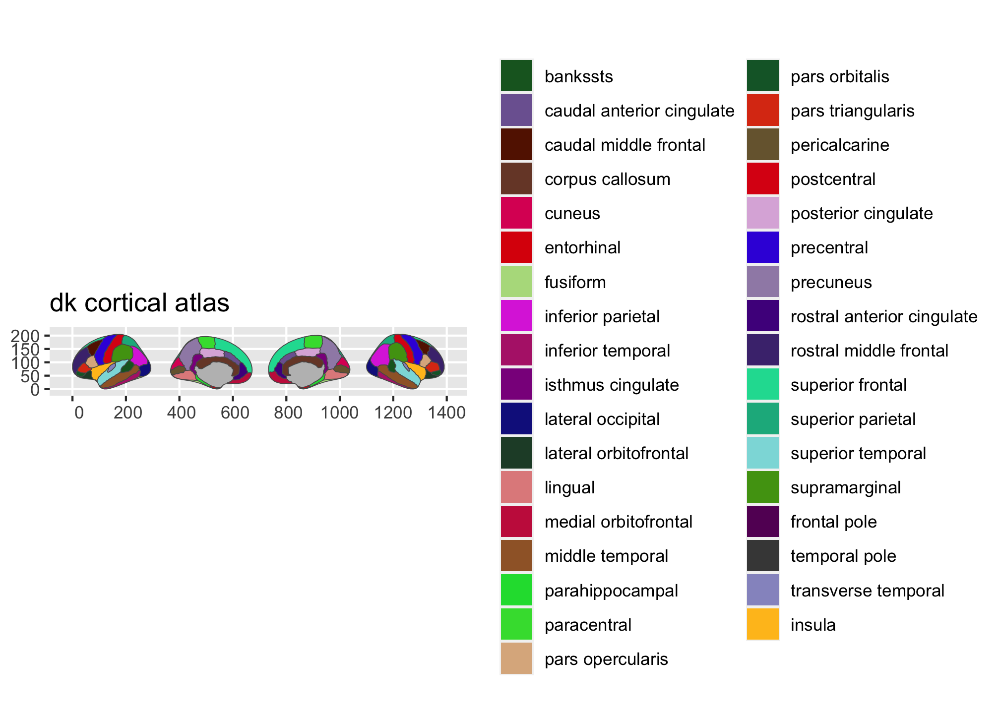
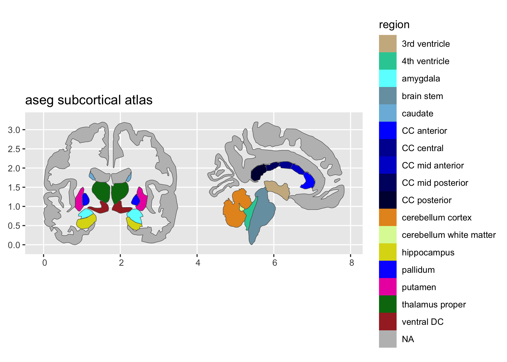
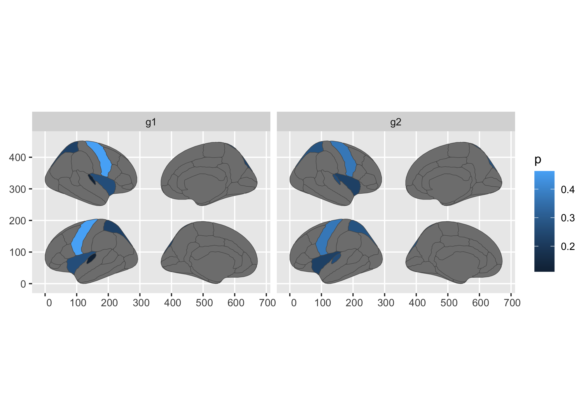

# ggseg 

<!-- badges: start -->

[](https://github.com/ggseg/ggseg/actions)
[](https://CRAN.R-project.org/package=ggseg)
[](https://r-pkg.org/pkg/ggseg)
[](https://app.codecov.io/gh/ggseg/ggseg)
[](https://lifecycle.r-lib.org/articles/stages.html)
[](https://app.codecov.io/gh/ggseg/ggseg)
<!-- badges: end -->

Contains ggplot2 geom for plotting brain atlases using simple features.
The largest component of the package is the data for the two built-in
atlases. Plotting results of analyses on regions or networks often
involves swapping between statistical tools, like R, and software for
brain imaging to correctly visualise analysis results.

This package aims to make it possible to plot results directly through
R.

## Atlases

There are currently four atlases available in the package:

1.  `dk` - Desikan-Killiany atlas (aparc).  
2.  `aseg` - Automatic subcortical segmentation.

**Note:** As of version 1.5.3, `ggseg` was split into two packages: one
for 2d polygon plots in ggplot, and another for 3d mesh plots through
plotly. This was done to reduce package size, dependencies, and also to
simplify maintenance. If you want the 3d plotting tool, please go the
[ggseg3d repository](https://github.com/ggseg/ggseg3d).

You may find more atlases and functions to create new atlases in the
companion package [ggsegExtra](https://github.com/ggseg/ggsegExtra).

## Installation

The package can be installed from CRAN.

``` r
install.packages("ggseg")
```

Alternatively, ggseg may also be installed through its ggseg r-universe:

``` r
# Enable this universe
options(repos = c(
    ggseg = 'https://ggseg.r-universe.dev',
    CRAN = 'https://cloud.r-project.org'))

# Install some packages
install.packages('ggseg')
```

The development version of the package can be installed using devtools.

``` r
install.packages("remotes")
remotes::install_github("ggseg/ggseg")
```

The functions are now installed, and you may load them when you want to
use them. All functions are documented in standard R fashion.

## Use

``` r
library(ggseg)
library(ggplot2)
plot(dk)
```



``` r
plot(aseg)
```



While default atlas plots will give you an idea of how the atlases look,
you will likely want to project your own data onto the plot.

``` r
library(dplyr)
#> 
#> Attaching package: 'dplyr'
#> The following objects are masked from 'package:stats':
#> 
#>     filter, lag
#> The following objects are masked from 'package:base':
#> 
#>     intersect, setdiff, setequal, union
some_data <- tibble(
  region = rep(c("transverse temporal", "insula",
           "precentral","superior parietal"), 2), 
  p = sample(seq(0,.5,.001), 8),
  groups = c(rep("g1", 4), rep("g2", 4))
)

some_data |>
  group_by(groups) |>
  ggplot() +
  geom_brain(atlas = dk, 
             position = position_brain(hemi ~ side),
             aes(fill = p)) +
  facet_wrap(~groups)
#> merging atlas and data by 'region'
```



The package also has several vignettes, to help you get started using
it. You can access it [here](https://ggseg.github.io/ggseg/)

You can also see one of the creators blog for introductions to its use
[here](https://drmowinckels.io/blog/2021-03-14-new-ggseg-with-geom/)

### Report bugs or requests

Don’t hesitate to ask for support using [github
issues](https://github.com/ggseg/ggseg/issues), or requesting new
atlases. While we would love getting help in creating new atlases, you
may also request atlases through the issues, and we will try to get to
it.

# Funding

This tool is partly funded by:

**EU Horizon 2020 Grant:** Healthy minds 0-100 years: Optimising the use
of European brain imaging cohorts (Lifebrain).

**Grant agreement number:** 732592.

**Call:** Societal challenges: Health, demographic change and well-being
